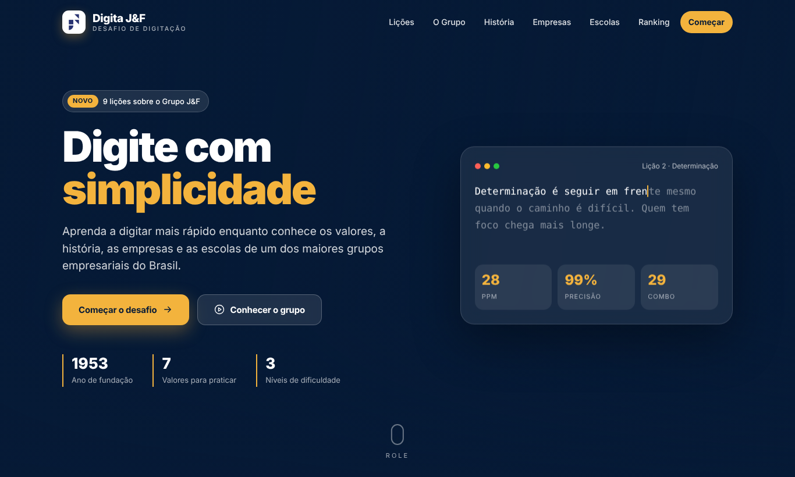
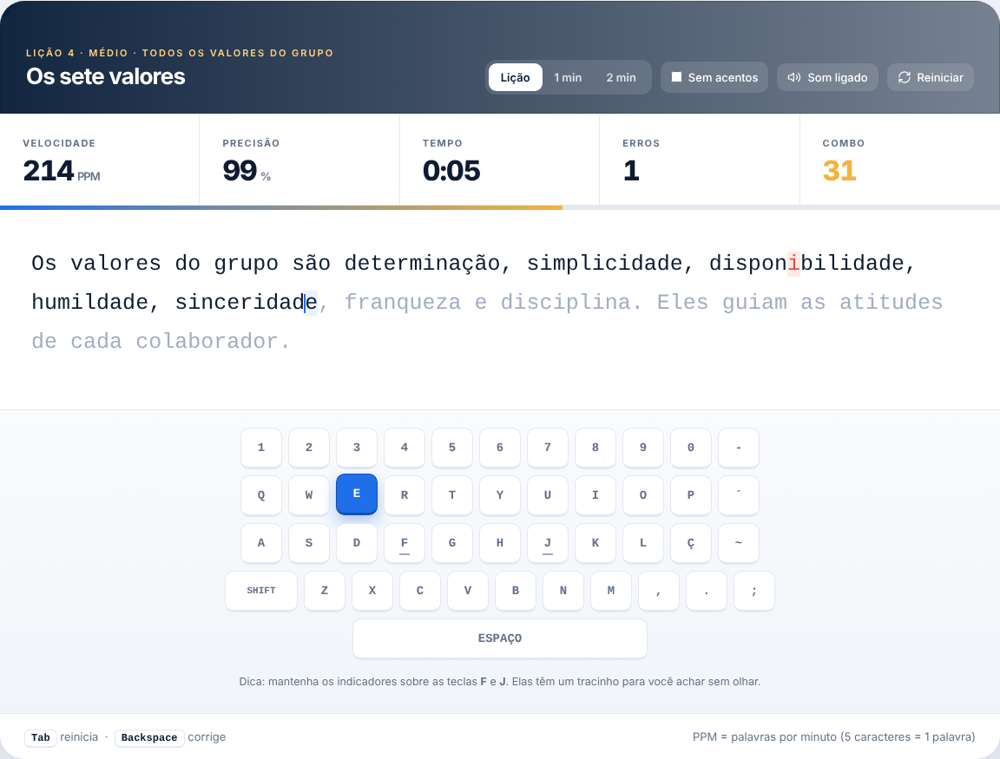
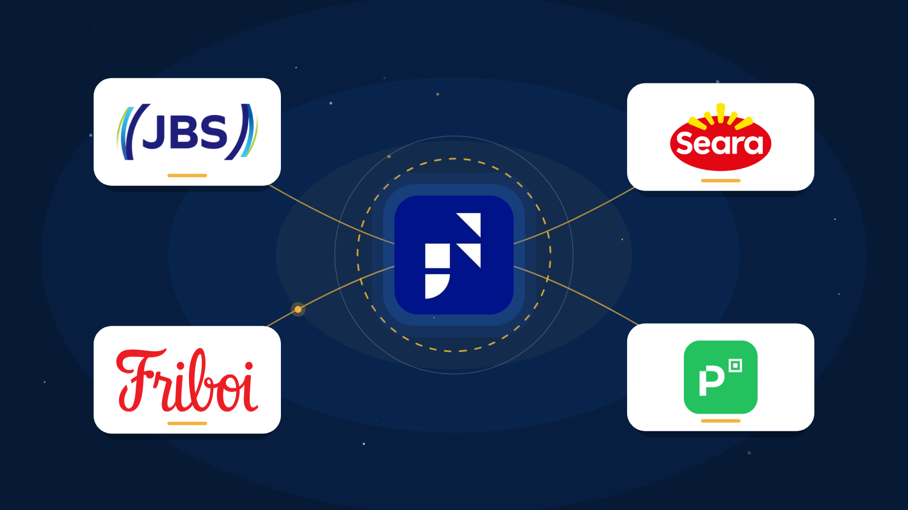
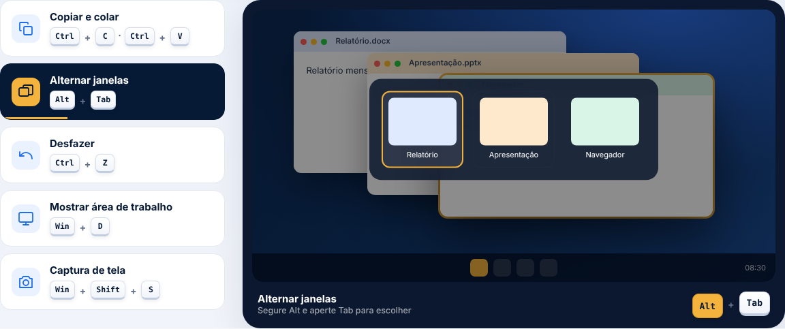
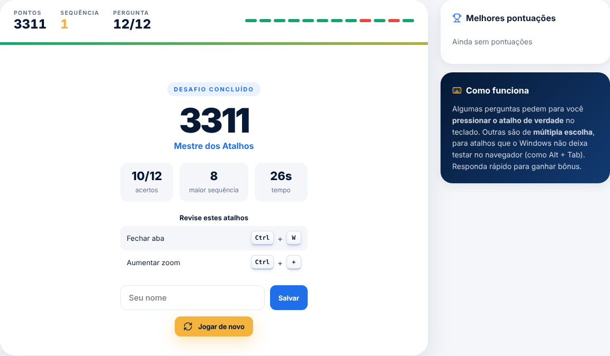
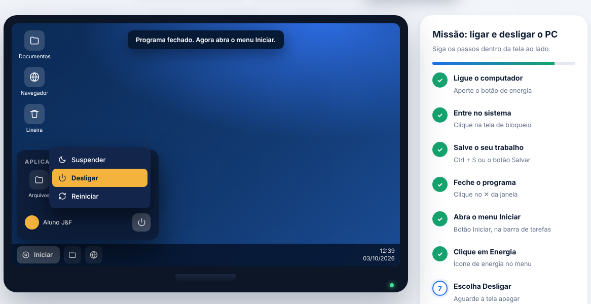
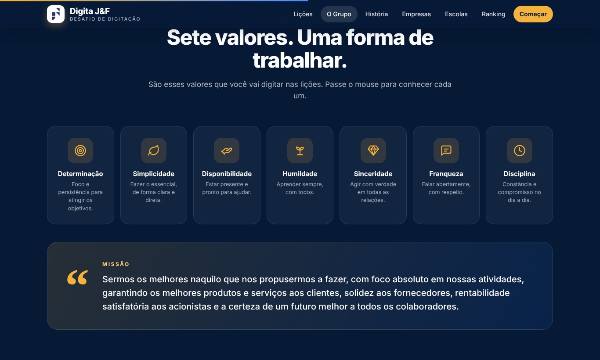

<div align="center">

# ⌨️ Digita J&F

### Desafio de digitação inspirado no universo do Grupo J&F

**Treine sua digitação enquanto aprende sobre valores, história, empresas e escolas de um dos maiores grupos empresariais do Brasil.**


<br>



</div>

---

## 📖 Sobre o projeto

O **Digita J&F** é um site de treino de digitação no estilo do Ratatype, mas com temática própria: todos os textos das lições falam sobre os **valores**, a **missão**, a **história**, as **empresas** e as **escolas** do Grupo J&F.

Ele nasceu como prática final de um **curso de informática básica** (comandos do PC, Word e PowerPoint). Além do treino de digitação, o site tem um módulo de **comandos do computador**, com atalhos, um desafio e um simulador de ligar e desligar o PC. A pessoa pratica o que aprendeu e, ao mesmo tempo, conhece melhor a cultura do grupo.

> Tudo roda direto no navegador. É um único arquivo `index.html`, sem instalação, sem servidor e sem bibliotecas externas.

---

## ✨ O que tem no site

<table>
<tr>
<td width="50%">

### 🎯 Área de treino
- 10 lições em 3 níveis (fácil, médio e difícil)
- Testes cronometrados de 1 e 2 minutos
- Velocidade em **PPM**, precisão, erros e tempo ao vivo
- **Combo** de acertos seguidos
- Teclado virtual que mostra a próxima tecla
- Opção **sem acentos** para iniciantes
- Sons de digitação (dá para desligar)

</td>
<td width="50%">

### 🏆 Motivação
- Gráfico da velocidade ao longo do teste
- 5 níveis: Semente, Germinando, Aprendiz J&F, Tocador de Negócios e Líder
- **Ranking da turma**
- **Certificado** para imprimir ou salvar em PDF
- Confete quando o desempenho é bom

</td>
</tr>
<tr>
<td colspan="2">

### 🖱️ Comandos do computador
- **Demonstrações animadas** de Copiar e colar, Alt + Tab, Desfazer, Win + D e Captura de tela, numa tela de PC simulada
- **Guia com 35 atalhos** do Windows, com busca e filtro por categoria (Texto, Arquivos, Janelas, Sistema e Navegador)
- **Desafio de atalhos**: 12 perguntas, em que você aperta o atalho de verdade no teclado ou escolhe entre 4 opções, com cronômetro, sequência de acertos, revisão dos erros e ranking
- **Simulador de ligar e desligar o PC**: ligar, entrar, salvar o arquivo, fechar o programa e desligar pelo menu Iniciar, com avisos quando a pessoa erra (por exemplo, tentar desligar com um arquivo aberto sem salvar)
- Cartões explicando **Desligar, Reiniciar e Suspender**, e o que nunca fazer

</td>
</tr>
<tr>
<td width="50%">

### 🏢 Conteúdo sobre o grupo
- Os **7 valores** com ícones animados
- A missão do grupo
- Linha do tempo de 1953 até hoje
- Cartões das empresas (JBS, Seara, Friboi, Eldorado, Âmbar, PicPay, Flora e Canal Rural)
- Seção do **Instituto J&F** e das escolas Germinare

</td>
<td width="50%">

### 🎨 Visual e animações
- Hero com vídeo, texto que se digita sozinho e demo ao vivo
- Efeitos de revelação ao rolar a página
- Contadores animados
- Cartões 3D que acompanham o mouse
- **Tela de carregamento com animação Lottie**: as marcas do grupo (JBS, Seara, Friboi, PicPay) se conectam ao J&F, com botão para pular
- Layout responsivo para celular

</td>
</tr>
</table>

---

## 📸 Veja como ficou

<table>
<tr>
<td><br><sub><b>Área de treino</b> com teclado virtual, combo e estatísticas</sub></td>
<td><br><sub><b>Resultado</b> com gráfico de velocidade e certificado</sub></td>
</tr>
<tr>
<td colspan="2"><br><sub><b>Tela de carregamento</b> com a animação Lottie das marcas do grupo</sub></td>
</tr>
<tr>
<td colspan="2"><br><sub><b>Comandos do PC</b>: demonstrações animadas de atalhos</sub></td>
</tr>
<tr>
<td><br><sub><b>Desafio de atalhos</b> com revisão dos erros</sub></td>
<td><br><sub><b>Simulador</b> para desligar o PC do jeito certo</sub></td>
</tr>
<tr>
<td><br><sub><b>Os 7 valores</b> que viram lições</sub></td>
<td><br><sub><b>Instituto J&F</b> e as escolas do grupo</sub></td>
</tr>
</table>

---

## 🚀 Como usar

### Opção 1: abrir direto
1. Baixe este repositório (**Code → Download ZIP**) ou clone:
   ```bash
   git clone https://github.com/dvarakaki/j-f-typing-test-web.git
   ```
2. Dê dois cliques em `index.html`.

Pronto. Não precisa instalar nada.

### Opção 2: publicar com GitHub Pages
1. No repositório, vá em **Settings → Pages**.
2. Em **Source**, escolha **Deploy from a branch**, selecione `main` e a pasta `/ (root)`.
3. Em alguns minutos o site fica disponível em `https://dvarakaki.github.io/j-f-typing-test-web/`.

> 🌐 Fotos ilustrativas e vídeos são carregados da internet. Sem conexão, o site funciona normalmente, mas algumas imagens ficam em branco.

---

## 🖼️ Como trocar as fotos e a logo

O site procura imagens locais antes de usar as fotos ilustrativas. Para trocar, basta salvar o arquivo na pasta `imagens/` **com o nome exato** abaixo (minúsculas, sem acento, em `.jpg`, `.png` ou `.webp`):

| O quê | Onde salvar |
|---|---|
| Logo e ícone da aba | `imagens/logo-jf.png` |
| JBS | `imagens/empresas/jbs.jpg` |
| Seara | `imagens/empresas/seara.jpg` |
| Friboi | `imagens/empresas/friboi.jpg` |
| Eldorado Brasil | `imagens/empresas/eldorado-brasil.jpg` |
| Âmbar Energia | `imagens/empresas/ambar-energia.jpg` |
| PicPay | `imagens/empresas/picpay.jpg` |
| Flora | `imagens/empresas/flora.jpg` |
| Canal Rural | `imagens/empresas/canal-rural.jpg` |
| Germinare Business | `imagens/escolas/germinare-business.jpg` |
| Germinare Tech | `imagens/escolas/germinare-tech.jpg` |
| Germinare Vet | `imagens/escolas/germinare-vet.jpg` |
| Escola da Família | `imagens/escolas/escola-da-familia.jpg` |
| Escola da Fábrica | `imagens/escolas/escola-da-fabrica.jpg` |
| Faculdade J&F | `imagens/escolas/faculdade-jef.jpg` |

Se um arquivo não existir, o site usa a imagem padrão. Tamanho ideal das fotos: cerca de 1200 × 800 pixels, na horizontal.

---

## ✏️ Como editar as lições

Todo o conteúdo fica no começo do bloco `<script>` do `index.html`. Para criar ou mudar uma lição, edite a lista `LESSONS`:

```js
{
  id: "l10",
  lv: 2,                       // 1 = fácil, 2 = médio, 3 = difícil
  img: IMG.field,              // foto do cartão
  title: "Minha lição",
  theme: "Assunto da lição",
  text: "O texto que a pessoa vai digitar."
}
```

As listas `VALUES`, `COMPANIES`, `TIMELINE` e `SCHOOLS` controlam as outras seções do site.

---

## 🧰 Tecnologias

- **HTML, CSS e JavaScript puros**, sem frameworks e sem etapa de build
- **Canvas API** para o gráfico e o confete
- **Web Audio API** para os sons de digitação
- **IntersectionObserver** para as animações de rolagem
- **[lottie-web](https://github.com/airbnb/lottie-web)** para a animação da tela de carregamento. O arquivo `animacoes/jf-marcas.json` pode ser aberto e editado no [Lottie Creator](https://lottiefiles.com/lottie-creator)
- Fontes **Montserrat**, **Inter** e **JetBrains Mono** (Google Fonts)

---

## 🗺️ Ideias para o futuro

- [ ] Ranking salvo de verdade (hoje ele zera ao recarregar a página)
- [ ] Modo de duelo entre dois alunos
- [ ] Mais lições, incluindo Word e PowerPoint
- [ ] Modo escuro
- [ ] Versão instalável (PWA) para funcionar offline

Sugestões são bem-vindas! Abra uma *issue* ou envie um *pull request*.

---

## ⚖️ Aviso legal

Este é um **projeto educacional e não oficial**, sem qualquer vínculo com o Grupo J&F, com o Instituto J&F ou com as empresas citadas. Nomes, logotipos e fotos de empresas pertencem a seus respectivos donos e são usados apenas para fins educacionais. Se for divulgar o site publicamente, peça autorização aos donos das marcas.

Fotos ilustrativas: [Unsplash](https://unsplash.com). Vídeos: [Mixkit](https://mixkit.co).

Os textos sobre valores e missão foram escritos para este projeto e devem ser conferidos com o material oficial antes de qualquer uso formal.

---

<div align="center">

Feito com ☕ e determinação por **[Davi](https://github.com/dvarakaki)**

</div>
